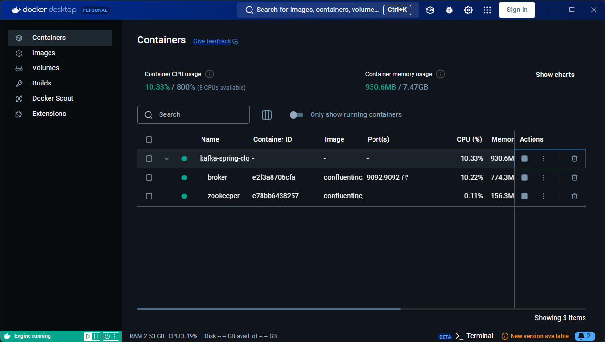
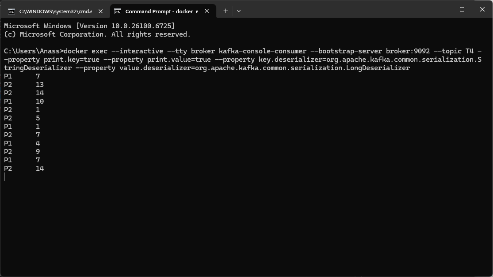
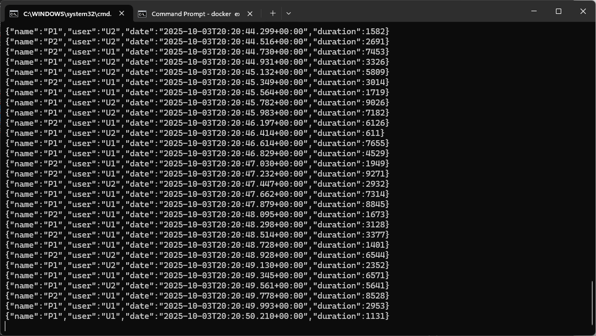
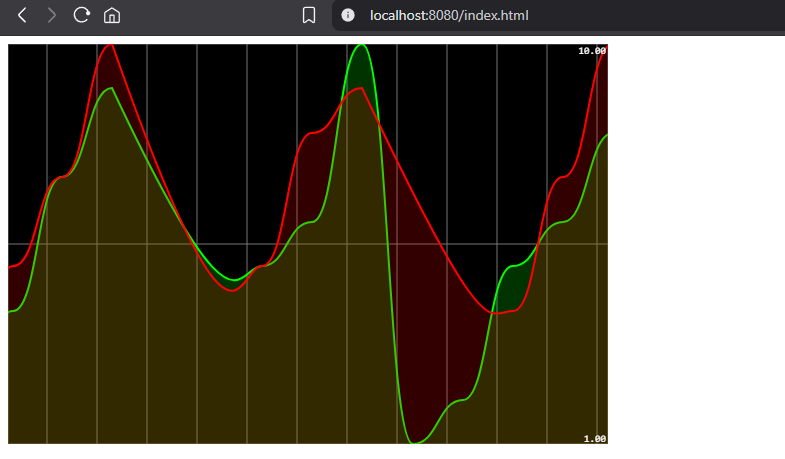

## Kafka + Spring Cloud Stream Demo

Event streaming demo using Spring Cloud Stream with Apache Kafka (broker + ZooKeeper via Docker). A simple producer emits random events, a consumer processes them, and a lightweight web UI visualizes the stream in real‑time.

### Screenshots









### Architecture

- **Spring producer**: publishes events to Kafka topics using Spring Cloud Stream binders
- **Kafka broker**: single-node Kafka (with ZooKeeper) running in Docker
- **Spring consumer(s)**: subscribes to topics and processes messages
- **Web UI**: static page (served locally) that renders a live chart from the stream

```
Producer -> Kafka (broker:9092) -> Consumer(s) -> (optional) Web UI @ localhost:8080
```

### Event shape

Example JSON payload emitted by the producer:

```json
{
  "name": "P1",
  "user": "U1",
  "date": "2025-10-03T20:20:44.299Z",
  "duration": 1582
}
```

Some topics also use `key=value` style records where the key is a string like `P1`/`P2` and the value is a number, as shown in the console consumer screenshot.

### Prerequisites

- Docker Desktop (or Docker Engine) running
- Java 17+ and Maven/Gradle (depending on this project’s build)

### Quick start

1. Start Kafka locally in Docker (broker + ZooKeeper). If you have a compose file, run:

```bash
docker compose up -d
```

Otherwise start the `broker` and `zookeeper` containers per your setup.

2. Build and run the Spring app:

```bash
# Maven
mvn spring-boot:run

# or Gradle
./gradlew bootRun
```

3. Open the Web UI:

```
http://localhost:8080/index.html
```

You should see a live chart similar to the screenshot above as events arrive.

### Verifying with Kafka CLI

Use the console consumer inside the `broker` container to observe a topic (replace `T1` with your topic name):

```bash
docker exec --interactive --tty broker \
  kafka-console-consumer \
  --bootstrap-server broker:9092 \
  --topic T1 \
  --property print.key=true \
  --property print.value=true \
  --property key.deserializer=org.apache.kafka.common.serialization.StringDeserializer \
  --property value.deserializer=org.apache.kafka.common.serialization.LongDeserializer
```

### Configuration

- Spring Cloud Stream binders and bindings are configured in `application.yml`/`application.properties`
- Default Kafka endpoint: `broker:9092` (mapped from Docker)

### Troubleshooting

- If the consumer prints nothing, ensure the producer is running and the topic names match
- If the web UI is blank, confirm the app serving the UI is running on port `8080`
- Check Docker Desktop to verify `broker` and `zookeeper` are healthy

### Folder layout (relevant parts)

- `src/main/...` – Spring Boot application code
- `docs/screenshots/` – PNG screenshots embedded in this README
